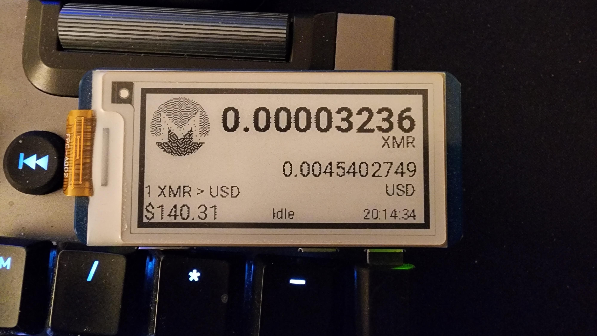

# Crypto Miner watcher 
This project is a simple script that reads how much some crypto miners have mined in unmineable and displays it on a 
e-paper display.

I was playing around and configured a couple of Raspberry Pis to mine Monero on unmineable.com. I wanted to have a way 
to see how much they have mined without having to open a website. So I decided to use a e-paper display to show me all
the profits (lol).

## Demo


## How it works
1. Fetches the current value of Monero in USD from Coinmarketcap
2. Fetches the amount of Monero mined from unmineable.com
3. Calculates the total value of Monero mined in USD
4. Displays the information on the e-paper display
5. Sleeps for 10 minutes and repeats the process
6. Extra: Every 24 hours, it will clear the screen and sleep for 10 seconds to prevent screen burn-in

## Hardware requirements
- Raspberry Pi Zero W
- [Waveshare 2.13inch e-Paper HAT (B)](https://www.waveshare.com/2.13inch-e-paper-hat.htm)

> If you don't have the display, it will just display the image locally using the Image.show() method.

## Software requirements
- System running Python 3
- I'm using `Raspberry Pi OS Lite`. You can use any other system as long as it supports Python 3
- API key from Coinmarketcap

## Prepare to use the Display.
1. Enable SPI interface
```shell
sudo raspi-config
```
Choose Interfacing Options -> SPI -> Yes Enable SPI interface

2. Install function libraries
```shell
sudo apt-get update;sudo apt-get upgrade -y
sudo apt-get install -y python3-pip python3-pil python3-numpy g
sudo pip3 install RPi.GPIO spidev
sudo apt-get install -y python3-gpiozero
``` 

3. Install the dependencies
In the folder where you cloned this repository, run the following command to install the dependencies:
```shell
pip install -r requirements.txt
```

You might need to run this first (if you don't want to create a virtual environment):
```shell
export PIP_BREAK_SYSTEM_PACKAGES=1
```

## Making the script run automatically on boot
To ensure that your `main.py` script runs every time the Raspberry Pi Zero boots and restarts in case of failure, 
create a systemd service following the steps below:

1. **Create a Systemd Service File:**
Open a terminal on your Raspberry Pi and create a new systemd service file.

```sh
sudo nano /etc/systemd/system/crypto_display.service
```

2. **Edit the Service File:**
Add the following content to the file:

For this example, consider:
User: `pi` -- Change this to be the user you want to run the script as. If you didn't change the username when setting up the Raspberry Pi, the default username is `pi`.
Path to the script: /home/pi/miner_display/crypto_display2_13inches/main.py -- Change this to the path where your `main.py` script is located.

```ini
[Unit]
Description=Crypto Display Service
After=network.target

[Service]
ExecStart=/usr/bin/python /home/pi/miner_display/crypto_display2_13inches//main.py
WorkingDirectory=/home/pi/miner_display/crypto_display2_13inches/
Restart=always
User=pi
Environment=PYTHONUNBUFFERED=1

[Install]
WantedBy=multi-user.target
```

3. **Save and Exit:**
Press `Ctrl+X`, then `Y`, and `Enter` to save and exit the nano editor.

4. **Reload Systemd:**
Reload systemd to apply the new service.

```sh
sudo systemctl daemon-reload
```

5. **Enable the Service:**
Enable the service to start on boot.

```sh
sudo systemctl enable crypto_display.service
```

6. **Start the Service:**
Start the service immediately.

```sh
sudo systemctl start crypto_display.service
```

7. **Check the Status:**
Verify that the service is running.

```sh
sudo systemctl status crypto_display.service
```

If the service is set up correctly, your `main.py` script should now run every time your Raspberry Pi boots and will 
automatically restart if it fails.
